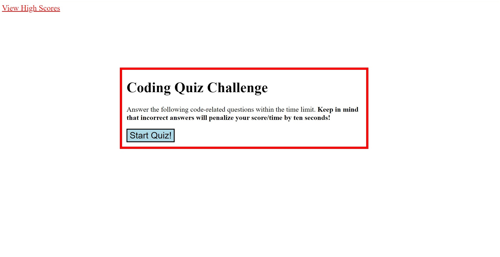
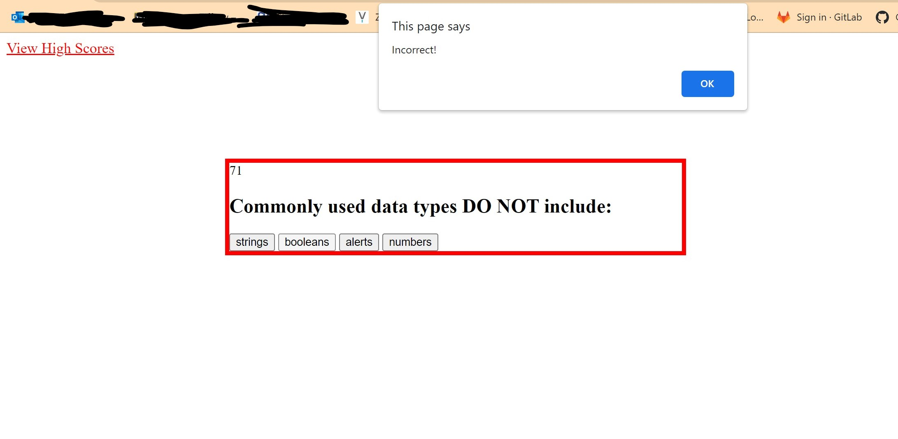
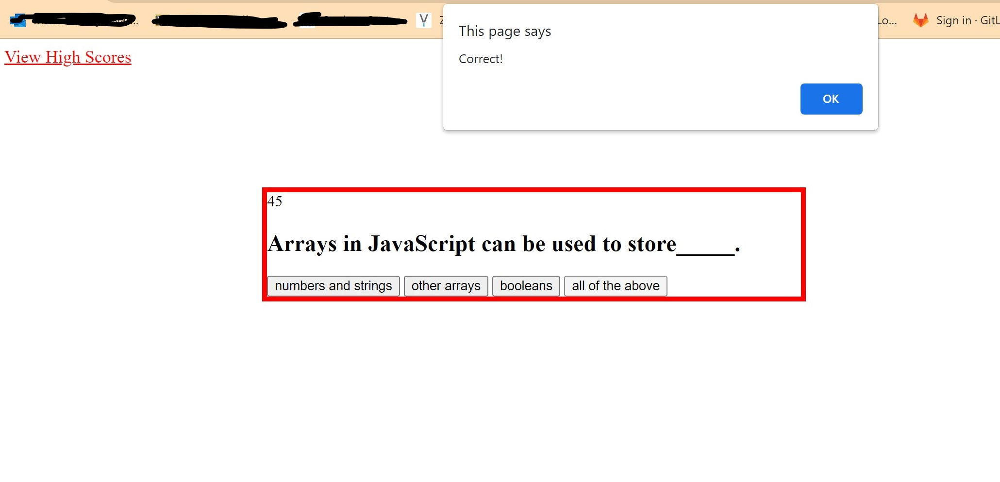
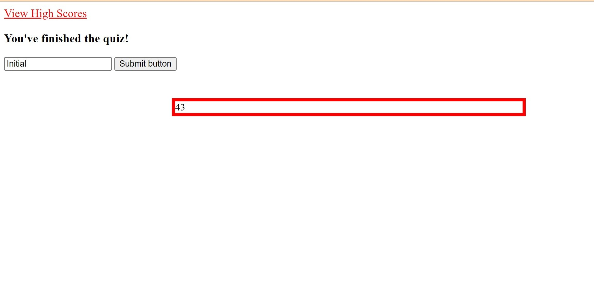

# Coding-Quiz
### Deployed Link: https://tiffyalva.github.io/code-quiz-challenge-4/ 

## Module 4 challenge

- This is a quiz project, questioning about coding. 
- I used HTML, CSS, and JavsScript.
- It has a timer and able to save scores with your initial. However, it's disabled at the moment.

### Start Quiz

### Incorrect

### Correct

### End Game with Initial Form

### High Scores

